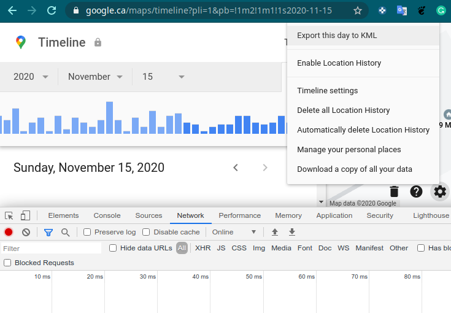
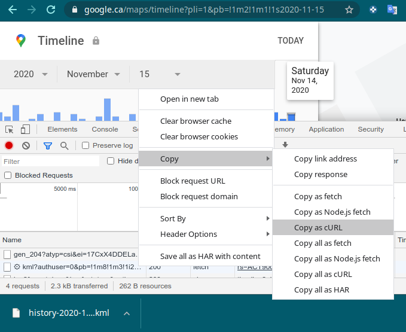
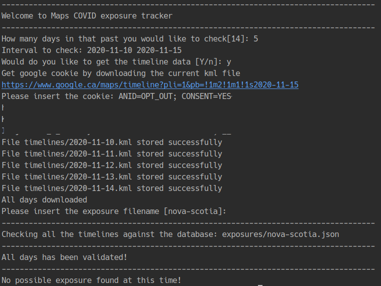

# Google Maps timeline Covid exposure tracker

Python command line app that help you to get your Google maps timelines in .kml files and process them to validate
possible Covid exposures based on preload exposure database.

#### Install and use conda Environment

```bash
conda env create -f environment.yml
conda activate mcet
```

## How to use:

Run the command line app with:
```bash
python start.py
```

The app will ask a couple questions to set up the necessary information

#### Choose how many days in the past you would like to check

The default value will be 14 days but you can select any value grater that 1

#### Get timelines from google maps

If you want the app to help you downloading the timelines .kml files answer (y) yes. Otherwise the app will validate the
files present in the `timelines` folder with filename like: `2020-11-15.kml`

#### Get your google cookie:
As google maps does not provide a dedicated API that we can use to get the timeline data, the only way is via cookie-jacking.

In order to export processed data from Google Maps from this python script, you need to get your actual cookie.

If you answered yes to the previous question the app will show a link that you can go to see your timeline of the current date

When you are in the google maps website, open the developer tools in the Network tab.

click in the google maps gear icon and click in Export this day to KML:



When you download the file you will see a new request, right click in the one that start with `kml?` and copy as cURL



Paste the cURL in a text editor and copy just the cookie content:
```
curl 'https://www.google.com/maps/timeline/kml?authuser=0&pb=!1m8!1m3!1i2017!2i3!3i16!2m3!1i2017!2i3!3i16'   
-H 'accept-encoding: gzip, deflate, sdch, br'   
-H 'accept-language: en-US,en;q=0.8,fr;q=0.6'   
-H 'upgrade-insecure-requests: 1'   
-H 'user-agent: Mozilla/5.0 (Macintosh; Intel Mac OS X 10_12_4) '   
-H 'x-chrome-uma-enabled: 1'   
-H 'accept: text/html,application/xhtml+xml,application/xml;q=0.9,image/webp,*/*;q=0.8' 
-H 'authority: www.google.com'   
-H 'cookie: gsScrollPos=; _ga=GA1.1.49937635TxMcGmJ-uXXXXX gsScrollPos='  
-H 'x-client-data: XXXQ==' --compressed 
```

Finally paste the cookie content in the app, if the cookie is valid, the app will download all the kml files inside 
the `timelines` folder, process them and give you a list of possible exposures if any.



#### Nova Scotia Covid Exposure database:

the `exposures/nova-scotia.json` has the list with all the possible exposures from `2020-10-24`. I will try to update
the file as much as possible. 
